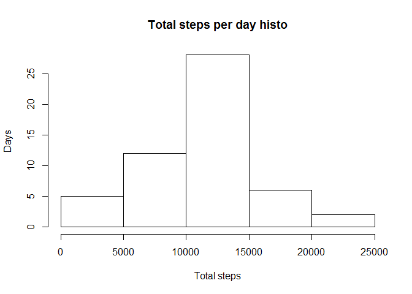
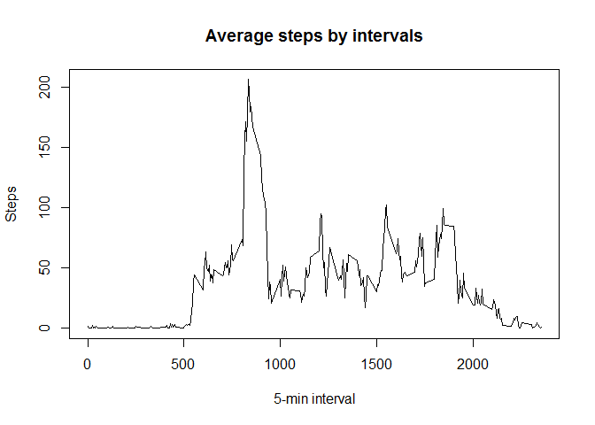
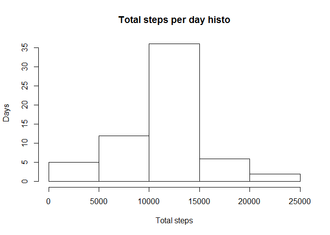
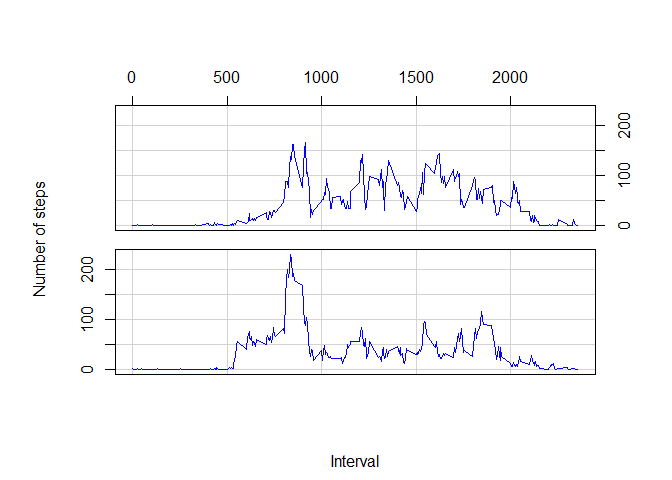

# Reproducible Research: Peer Assessment 1


Activity monitoring is one of the most popular modern application of data science:)  
Particularly we found a lot of data about walking activity of some person in the form of zipped activity.csv file and going to analyze them unpacking properly first.  
Dataset contains:  
- steps: Number of steps taking in a 5-minute interval (missing values are coded as NA)  
- date: The date on which the measurement was taken in YYYY-MM-DD format  
- interval: Identifier for the 5-minute interval in which measurement was taken  

## Loading and preprocessing the data

First of all let's load data and make a shot view on them

```r
setwd(".")
unzip("activity.zip",exdir=".")
activity <- read.csv("activity.csv")
str(activity)
```

```
## 'data.frame':	17568 obs. of  3 variables:
##  $ steps   : int  NA NA NA NA NA NA NA NA NA NA ...
##  $ date    : Factor w/ 61 levels "2012-10-01","2012-10-02",..: 1 1 1 1 1 1 1 1 1 1 ...
##  $ interval: int  0 5 10 15 20 25 30 35 40 45 ...
```
Obviously they contains a lot of Not Available values in the "steps" field.  
Now let's clean data from NA and see again.

```r
data_clean <- subset(activity, !is.na(activity$steps))
str(data_clean)
```

```
## 'data.frame':	15264 obs. of  3 variables:
##  $ steps   : int  0 0 0 0 0 0 0 0 0 0 ...
##  $ date    : Factor w/ 61 levels "2012-10-01","2012-10-02",..: 2 2 2 2 2 2 2 2 2 2 ...
##  $ interval: int  0 5 10 15 20 25 30 35 40 45 ...
```
Oh! Now our data is looking much better :)  
  


## What is mean total number of steps taken per day?
Now let's calculate the total number of steps taken per day

```r
total_steps <- aggregate(data_clean$steps, by=list(data_clean$date), FUN=sum)
colnames(total_steps) <- c("Date", "Steps")
head(total_steps)
```

```
##         Date Steps
## 1 2012-10-02   126
## 2 2012-10-03 11352
## 3 2012-10-04 12116
## 4 2012-10-05 13294
## 5 2012-10-06 15420
## 6 2012-10-07 11015
```

Looks good!  
So we are ready to plot a histogram of this total values below.  
Make sure that you understand from the plot that most frequently the person performed from 10 upto 15 thousand of steps during a day.  
Such days were 25 from 61 total days of observations.


```r
hist(total_steps$Steps, main="Total steps per day histo", xlab="Total steps", ylab="Days")
```

 

Let's calculate and report mean and median of total steps per day.

```r
mean(total_steps$Steps)
```

```
## [1] 10766.19
```


```r
median(total_steps$Steps)
```

```
## [1] 10765
```


## What is the average daily activity pattern?
Now, that is a really interesting question which time of day a person more moving on the feet than another time.  
Let's prepare a proper data set

```r
steps_by_interval <- aggregate(data_clean$steps, by=list(data_clean$interval), FUN=mean)
colnames(steps_by_interval) <- c("Interval", "Steps")
head(steps_by_interval)
```

```
##   Interval     Steps
## 1        0 1.7169811
## 2        5 0.3396226
## 3       10 0.1320755
## 4       15 0.1509434
## 5       20 0.0754717
## 6       25 2.0943396
```

and now plot it to make evident which of 5-min intervals is the champion!

```r
plot(steps_by_interval$Interval, steps_by_interval$Steps, type="l", main="Average steps by intervals", xlab="5-min interval", ylab="Steps")
```

 

Ha-ha! As you can see it's a very sharped guy and he lives about 800th interval.  
Let's calculate exactly

```r
max_by_cols <- sapply(steps_by_interval, max, na.rm = TRUE)
max_steps_int <- steps_by_interval[steps_by_interval$Steps == max_by_cols[2],][[1]]
max_steps_int
```

```
## [1] 835
```

Perfect! And what hour is that moment?

```r
max_steps_int %/% 60
```

```
## [1] 13
```

And on which minute of hour?

```r
max_steps_int %% 60
```

```
## [1] 55
```

Aha! 13:55! We can guess that's time when the person was hurrying back to work after the lunch :)  
Agree?  


## Imputing missing values
For continuation of our study we need more accurately deal with NA values which were just thrown out at the beginning above.  
Now let's at first calculate and report the total number of missing values in the original activity dataset (i.e. the total number of rows with NAs)

```r
nrow(subset(activity, is.na(activity$steps)))
```

```
## [1] 2304
```
We want to replace NA values with the mean calculated above for the corresponding interval

```r
i <- 0
activity_no_NA = activity
while (i < nrow(activity)){
    i <- i + 1
    if (is.na(activity[i,]$steps)){
        activity_no_NA[i,]$steps <- subset(steps_by_interval, steps_by_interval$Interval == activity[i,]$interval)[[2]]
    }     
}
nrow(subset(activity_no_NA, is.na(activity_no_NA$steps)))
```

```
## [1] 0
```

Now let's recreate a histogram of the total number of steps taken each day 


```r
total_steps2 <- aggregate(activity_no_NA$steps, by=list(activity_no_NA$date), FUN=sum)
colnames(total_steps2) <- c("Date", "Steps")
hist(total_steps2$Steps, main="Total steps per day histo", xlab="Total steps", ylab="Days")
```

 

and recalculate and report the mean and median total number of steps taken per day: 


```r
mean(total_steps2$Steps)
```

```
## [1] 10766.19
```


```r
median(total_steps2$Steps)
```

```
## [1] 10766.19
```

*Do these values differ from the estimates from the first part of the assignment?*  

We can only notice a slight diff in median value which is equal to mean now. That's because we changed a part of data to the mean value.  

*What is the impact of imputing missing data on the estimates of the total daily number of steps?*  

We conclude that actually no impact. But now even more days (35 against 25) belong to the most popular range.  


## Are there differences in activity patterns between weekdays and weekends?
Now we create a new factor variable in the dataset with two levels - "weekday" and "weekend" indicating whether a given date is a weekday or weekend day.  
And repeat calculations above of mean steps by interval but splitting additionally by factor weekday.

```r
activity_no_NA$weekday <- sapply(activity_no_NA$date, function(d) if (as.POSIXlt(d)$wday > 0 & as.POSIXlt(d)$wday < 6) "Weekday" else "Weekend")
steps_weekday_interval <- aggregate(activity_no_NA$steps, by=list(activity_no_NA$weekday, activity_no_NA$interval), FUN=mean)
colnames(steps_weekday_interval) <- c("Weekday", "Interval", "Steps")
```

And now we create a plot for these data.  
Weekens are at upper plot and usual weekdays are on the lower one.  
You can see a sufficient difference in number of steps distribution depending of kind of day.


```r
coplot(Steps ~ Interval | Weekday , rows=2, columns=1, type="l", xlab=c("Interval",""), ylab="Number of steps", data=steps_weekday_interval, show.given=FALSE, col="blue", main="", axlabels=function(x) x)
```

 

